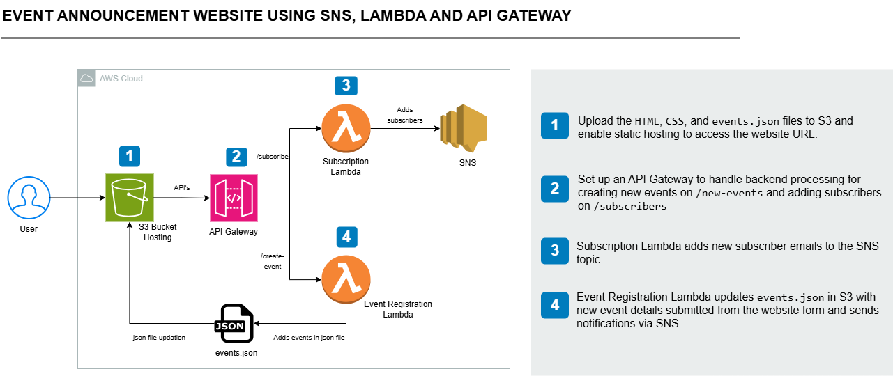

# Event Announcement System

A serverless **Event Announcement System** built using **Amazon S3, Amazon SNS, AWS Lambda, Amazon API Gateway, and IAM**.

The application allows users to view events, subscribe to event notifications, and create new events through a web interface. When a new event is created, the event data is stored in Amazon S3 and subscribers are notified through Amazon SNS.

---

# 1. Project Overview

## 1.1 Project Overview

This project demonstrates how to build a simple **Event Announcement System** using AWS serverless services.

The application allows users to:

* Subscribe to event notifications via email.
* View a list of available events.
* Create new events through a web form.

The frontend consists of **HTML, CSS, JavaScript, and `events.json`** files. These files are uploaded to **Amazon S3**, which is configured for static website hosting.

**Amazon API Gateway** provides backend API endpoints for the frontend:

* `POST /subscribe` — Adds a new subscriber to the event notification system.
* `POST /create-event` — Creates a new event and triggers an event notification.

AWS Lambda functions handle the backend processing:

* **Subscription Lambda** receives subscriber email addresses and creates subscriptions to the Amazon SNS topic.
* **Event Creation Lambda** receives new event details, updates the `events.json` file stored in Amazon S3, and publishes an event notification through Amazon SNS.

---

## Services Used 🛠️

| AWS Service            | Purpose                                                   |
| ---------------------- | --------------------------------------------------------- |
| **Amazon S3**          | Hosts the frontend website and stores `events.json`       |
| **Amazon SNS**         | Manages email subscriptions and sends event notifications |
| **AWS Lambda**         | Handles subscription and event creation logic             |
| **Amazon API Gateway** | Provides API endpoints for the frontend                   |
| **AWS IAM**            | Provides permissions for Lambda to access S3 and SNS      |

---

## Architecture Diagram

## Architecture Diagram



---

## Estimated Time & Cost

**Estimated Time:** 2–3 hours

**Cost:** Free Tier Eligible

> Actual AWS charges may vary depending on AWS account eligibility, resource configuration, and usage.

---

## Steps to Be Performed

1. Set up frontend hosting with Amazon S3.
2. Integrate Amazon SNS notifications and Lambda functions.
3. Set up, test, and deploy Amazon API Gateway.
4. Update the frontend with API Gateway endpoints.
5. Test and finalize the application.

---

# 1.2 Set Up Frontend Hosting with Amazon S3

This step involves creating and hosting the frontend for the Event Announcement System using **Amazon S3 Static Website Hosting**.

## 1.2.1 Create the Website Frontend Files

The frontend consists of three main files:

### `index.html`

Provides the structure and content of the website.

The page:

* Displays the list of events from `events.json`.
* Contains a form for creating new events.
* Includes a **Subscribe to Events** button.

### `styles.css`

Defines the visual appearance and layout of the website.

### `events.json`

Stores the event information displayed on the website.

Each event contains:

* Event title
* Event date
* Event description

### Main JavaScript Functions

| Function                | Purpose                                       |
| ----------------------- | --------------------------------------------- |
| `loadEvents()`          | Fetches `events.json` and displays the events |
| `subscribeToEvents()`   | Sends the user's email address to the backend |
| `submitNewEvent(event)` | Sends new event details to the backend        |

### Example JSON Structure

```json
[
  {
    "title": "AWS Community Meetup",
    "date": "2026-08-15",
    "description": "An introductory session on AWS serverless services."
  },
  {
    "title": "Cloud Technology Workshop",
    "date": "2026-08-22",
    "description": "A hands-on workshop covering cloud architecture."
  }
]
```

---

## 1.2.2 Create an S3 Bucket

1. Open the **AWS Management Console**.
2. Navigate to **Amazon S3**.
3. Click **Create bucket**.
4. Provide a globally unique bucket name.

Example:

```text
event-announcement-website
```

5. Under **Block Public Access settings**, disable **Block all public access**.
6. Acknowledge the warning.
7. Click **Create bucket**.

> **Security Note:** Public access is being enabled because this project uses S3 static website hosting. For a production application, a better architecture would be to keep the S3 bucket private and use Amazon CloudFront with Origin Access Control (OAC).

---

## 1.2.3 Upload Website Files

Open the S3 bucket and click **Upload**.

Upload:

```text
index.html
styles.css
events.json
```

Verify that all files are present in the bucket.

---

## 1.2.4 Enable Static Website Hosting

1. Open the S3 bucket.
2. Go to **Properties**.
3. Scroll to **Static website hosting**.
4. Click **Edit**.
5. Enable static website hosting.
6. Select **Host a static website**.
7. Enter:

```text
index.html
```

as the Index document.

8. Leave the Error document blank.
9. Click **Save changes**.

S3 will provide a **Bucket website endpoint**.

---

## 1.2.5 Configure Permissions for Public Access

Navigate to:

**S3 → Bucket → Permissions → Bucket policy**

Add:

```json
{
  "Version": "2012-10-17",
  "Statement": [
    {
      "Effect": "Allow",
      "Principal": "*",
      "Action": "s3:GetObject",
      "Resource": "arn:aws:s3:::<YOUR-UNIQUE-BUCKET-NAME>/*"
    }
  ]
}
```

Replace:

```text
<YOUR-UNIQUE-BUCKET-NAME>
```

with your actual bucket name.

This allows users to retrieve the website objects through the S3 website endpoint.

---

## 1.2.6 Verify the Website

1. Go to the S3 bucket **Properties**.
2. Locate **Static website hosting**.
3. Copy the **Bucket website endpoint**.
4. Open it in a browser.

Verify that:

* Website loads successfully.
* CSS styling is applied.
* Events from `events.json` are displayed.
* Subscribe functionality is visible.
* Create Event functionality is visible.

At this point, the frontend is hosted on S3.

---

# 1.3 Integrate SNS Notifications and Lambda Functions

Amazon SNS and AWS Lambda provide the backend notification and event-processing functionality.

## Steps to Be Performed

1. Create an SNS topic.
2. Create and test the Subscription Lambda.
3. Create and test the Event Creation Lambda.

---

## 1.3.1 Create an SNS Topic

Amazon SNS will be used to manage subscribers and send notifications when new events are created.

### Create the Topic

1. Open the **Amazon SNS Console**.
2. Select **Topics**.
3. Click **Create topic**.
4. Select **Standard**.
5. Enter:

```text
EventAnnouncements
```

6. Leave the remaining settings as default.
7. Click **Create topic**.

### Save the Topic ARN

After creation, locate the Topic ARN.

Example:

```text
arn:aws:sns:us-east-1:123456789012:EventAnnouncements
```

Save this ARN because it will be used by both Lambda functions.

---

# 1.3.2 Create and Test the Subscription Lambda

The Subscription Lambda subscribes users to the SNS topic using their email address.

## Create the IAM Role

Create an IAM role for Lambda.

### Trusted Entity

Select:

```text
AWS Service → Lambda
```

### Permissions

For this learning project, attach:

```text
AmazonSNSFullAccess
AWSLambdaBasicExecutionRole
```

### Role Name

```text
LambdaSubscribeRole
```

Click **Create role**.

> **Security Note:** `AmazonSNSFullAccess` is broader than necessary. A production implementation should use a least-privilege policy allowing only the required SNS actions on the specific topic.

---

## Create the Lambda Function

1. Open the **AWS Lambda Console**.
2. Click **Create function**.
3. Select **Author from scratch**.

Configure:

| Setting        | Value                    |
| -------------- | ------------------------ |
| Function name  | `SubscribeToSNSFunction` |
| Runtime        | Python 3.12              |
| Execution role | Existing role            |
| Role           | `LambdaSubscribeRole`    |

Click **Create function**.

---

## Add the Function Code

The Lambda source code is maintained in this repository under:

```text
lambda/SubscribeToSNSFunction/
```

Copy the function code from that folder and paste it into the Lambda inline editor.

The function:

1. Logs the incoming event.
2. Extracts the request body.
3. Retrieves the email address.
4. Calls Amazon SNS.
5. Creates an email subscription.
6. Returns a response.

The SNS subscription is created using:

```python
sns_client.subscribe(
    TopicArn='enter-sns-topic-ARN',
    Protocol='email',
    Endpoint=email
)
```

Replace:

```text
enter-sns-topic-ARN
```

with the ARN of the `EventAnnouncements` SNS topic.

Click **Deploy**.

---

## Test the Subscription Lambda

Create a Lambda test event:

```json
{
  "body": {
    "email": "user@example.com"
  }
}
```

Name:

```text
TestSubscribeEvent
```

Click **Save** and then **Test**.

### Verify the Subscription

1. Open the SNS Console.
2. Open `EventAnnouncements`.
3. Go to **Subscriptions**.
4. Verify the email address.
5. Check the email inbox.
6. Click the SNS confirmation link.

The subscription should change from:

```text
Pending confirmation
```

to:

```text
Confirmed
```

---

# 1.3.3 Create and Test the Event Creation Lambda

The Event Creation Lambda:

* Reads `events.json` from S3.
* Adds the new event.
* Updates `events.json`.
* Publishes an SNS notification.

## Create the IAM Role

Create a Lambda execution role with:

```text
AmazonS3FullAccess
AmazonSNSFullAccess
AWSLambdaBasicExecutionRole
```

Role name:

```text
EventCreationLambdaRole
```

> For production workloads, replace these broad managed policies with least-privilege policies restricted to the specific S3 bucket/object and SNS topic.

---

## Create the Lambda Function

Configure:

| Setting        | Value                     |
| -------------- | ------------------------- |
| Function name  | `createEventFunction`     |
| Runtime        | Python 3.12               |
| Execution role | Existing role             |
| Role           | `EventCreationLambdaRole` |

Click **Create function**.

---

## Add the Function Code

The Lambda source code is maintained in:

```text
lambda/createEventFunction/
```

Copy the code from that folder and paste it into the Lambda inline editor.

Update:

```python
bucket_name = 'your-bucket-name'
events_file_key = 'events.json'
sns_topic_arn = 'your-sns-topic-arn'
```

Replace:

* `your-bucket-name` → Your S3 bucket name.
* `your-sns-topic-arn` → Your SNS Topic ARN.

The function creates reusable S3 and SNS clients outside the Lambda handler:

```python
s3 = boto3.client('s3')
sns = boto3.client('sns')
```

This allows the clients to potentially be reused across warm Lambda invocations.

Click **Deploy**.

---

## Test the Event Creation Lambda 

Create a test event:

```json
{
  "body": "{\"title\":\"Tech Meetup\",\"date\":\"2024-12-01\",\"description\":\"A gathering of tech enthusiasts!\"}"
}
```

Name:

```text
TestEventCreation
```

Click **Save** and then **Test**.

### Verify S3

Open the S3 bucket and check `events.json`.

Verify that the new event has been added.

### Verify SNS

Verify that the Lambda published a notification to the `EventAnnouncements` topic.

### Verify Email

Check the inbox of a confirmed subscriber.

The subscriber should receive the new event notification.

---

# 1.4 Set Up, Test, and Deploy the API Gateway 🚀

API Gateway provides the HTTP interface between the S3-hosted frontend and Lambda functions.

## Steps to Be Performed

1. Create a REST API.
2. Create and test `/subscribe`.
3. Create and test `/create-event`.
4. Deploy the API.

---

## 1.4.1 Create a REST API

1. Open **Amazon API Gateway**.
2. Click **Create API**.
3. Under **REST API**, click **Build**.

Configure:

| Setting       | Value                |
| ------------- | -------------------- |
| API Details   | New API              |
| API Name      | `EventManagementAPI` |
| Endpoint Type | Regional             |

Click **Create API**.

---

# 1.4.2 Create and Test `/subscribe` 📧

## Create the Resource

1. Select the root `/`.
2. Click **Create Resource**.
3. Configure:

```text
Resource Name: subscribe
Resource Path: /subscribe
```

4. Enable CORS.
5. Click **Create Resource**.

---

## Create the POST Method

1. Select `/subscribe`.
2. Click **Create Method**.
3. Select **POST**.
4. Set integration type to **Lambda Function**.
5. Select:

```text
SubscribeToSNSFunction
```

6. Create the method.

---

## Enable CORS

Select the `/subscribe` POST method.

Choose **Enable CORS** and configure the required settings.

Save the configuration.

---

## Add the Mapping Template

The Subscription Lambda expects the request to contain a `body` field.

Navigate to:

**POST → Integration Request → Mapping Templates**

Add:

```text
application/json
```

Use:

```text
{
  "body": $input.json('$')
}
```

This transforms the request before it reaches Lambda.

For example, the frontend sends:

```json
{
  "email": "user@example.com"
}
```

API Gateway transforms it into:

```json
{
  "body": {
    "email": "user@example.com"
  }
}
```

This matches the structure expected by `SubscribeToSNSFunction`.

---

## Test `/subscribe`

In API Gateway, select the POST method and click **Test**.

Request body:

```json
{
  "email": "user@example.com"
}
```

Verify:

* API Gateway invokes Lambda.
* Lambda creates the SNS subscription.
* SNS sends the confirmation email.

---

# 1.4.3 Create and Test `/create-event`

## Create the Resource

1. Select the root `/`.
2. Click **Create Resource**.
3. Configure:

```text
Resource Name: create-event
Resource Path: /create-event
```

4. Click **Create Resource**.

---

## Create the POST Method

1. Select `/create-event`.
2. Click **Create Method**.
3. Select **POST**.
4. Set integration type to **Lambda Function**.
5. Enable **Lambda Proxy Integration**.
6. Select:

```text
createEventFunction
```

7. Click **Create Method**.

---

## Enable CORS

Select the `/create-event` POST method.

Select **Enable CORS**, configure the required settings, and save.

---

## Test `/create-event`

Use:

```json
{
  "title": "Tech Meetup",
  "date": "2024-12-01",
  "description": "A gathering of tech enthusiasts!"
}
```

Click **Test**.

Verify:

* `createEventFunction` executes.
* `events.json` is updated in S3.
* SNS publishes a notification.
* Confirmed subscribers receive the notification.

---

# 1.4.4 API Gateway Integration Difference

The two endpoints use different API Gateway integration configurations.

Understanding this difference is important because it affects the event structure received by each Lambda function.

## `/subscribe` — Mapping Template

The `/subscribe` endpoint uses a custom mapping template:

```text
{
  "body": $input.json('$')
}
```

The frontend sends:

```json
{
  "email": "user@example.com"
}
```

API Gateway transforms it into:

```json
{
  "body": {
    "email": "user@example.com"
  }
}
```

The Subscription Lambda accesses the email using:

```text
event → body → email
```

This matches the Lambda code:

```python
body = event['body'] if isinstance(event['body'], dict) else json.loads(event['body'])
email = body.get('email', None)
```

---

## `/create-event` — Lambda Proxy Integration

The `/create-event` endpoint uses **Lambda Proxy Integration**.

API Gateway passes the request to Lambda using the standard API Gateway event structure.

The Lambda receives the request body as a JSON string:

```json
{
  "body": "{\"title\":\"Tech Meetup\",\"date\":\"2024-12-01\",\"description\":\"A gathering of tech enthusiasts!\"}"
}
```

The Lambda parses it using:

```python
new_event = json.loads(event['body'])
```

---

## Comparison

| Endpoint        | Integration              | Lambda Request Format      |
| --------------- | ------------------------ | -------------------------- |
| `/subscribe`    | Mapping Template         | Custom `body` structure    |
| `/create-event` | Lambda Proxy Integration | Standard API Gateway event |

Therefore, the Lambda test events must also be different.

### Subscription Lambda Test

```json
{
  "body": {
    "email": "user@example.com"
  }
}
```

### Event Creation Lambda Test

```json
{
  "body": "{\"title\":\"Tech Meetup\",\"date\":\"2024-12-01\",\"description\":\"A gathering of tech enthusiasts!\"}"
}
```

> **Key Learning:** API Gateway integration configuration directly affects the event structure received by Lambda. The API Gateway configuration and Lambda event-parsing logic must be designed to work together.

---

# 1.4.5 Deploy the API

The API must be deployed before the frontend can access it.

1. In API Gateway, select the root `/`.
2. Click **Deploy API**.
3. Select **New Stage**.
4. Enter:

```text
dev
```

5. Click **Deploy**.

---

## Copy the Invoke URL

After deployment, API Gateway provides an Invoke URL:

```text
https://<api-id>.execute-api.<region>.amazonaws.com/dev
```

The endpoint URLs are:

### Subscribe

```text
https://<api-id>.execute-api.<region>.amazonaws.com/dev/subscribe
```

### Create Event

```text
https://<api-id>.execute-api.<region>.amazonaws.com/dev/create-event
```

Save these URLs because they will be added to the frontend JavaScript.

---

# 1.5 Test and Finalize

The final step is to connect the frontend to API Gateway and test the complete application.

## Steps to Be Performed

1. Update the frontend code.
2. Upload the updated files to S3.
3. Test the website.

---

# 1.5.1 Update the Frontend Code

Open:

```text
index.html
```

Update the API Gateway endpoints used by the JavaScript functions.

## Subscription Function

The `subscribeToEvents()` function sends the user's email to the `/subscribe` API.

Replace:

```text
<YOUR_SUBSCRIBE_API_ENDPOINT>
```

with:

```text
https://<api-id>.execute-api.<region>.amazonaws.com/dev/subscribe
```

The function sends:

```javascript
body: JSON.stringify({ email: email })
```

---

## Event Creation Function

The `submitNewEvent()` function sends event details to `/create-event`.

Replace:

```text
<YOUR_CREATE_EVENT_API_ENDPOINT>
```

with:

```text
https://<api-id>.execute-api.<region>.amazonaws.com/dev/create-event
```

The request contains:

```javascript
const newEvent = {
    title: title,
    date: date,
    description: description
};
```

---

## Where to Find the API Gateway URLs

Navigate to:

**API Gateway → EventManagementAPI → Stages → dev**

Copy the **Invoke URL**.

Then append:

```text
/subscribe
```

or:

```text
/create-event
```

---

# 1.5.2 Upload the Updated Files to S3

After updating `index.html`:

1. Open the **Amazon S3 Console**.
2. Open the website bucket.
3. Click **Upload**.
4. Upload the updated `index.html`.
5. Upload any other modified frontend files.

The updated website is now connected to API Gateway.

---

# 1.5.3 Test the Website

Open the S3 static website URL in a browser.

## Test the Subscription Feature

1. Click **Subscribe to Events**.
2. Enter an email address.
3. Submit the subscription.
4. Verify that the request reaches API Gateway.
5. Verify that the Subscription Lambda executes.
6. Check the email inbox.
7. Confirm the SNS subscription.

Expected flow:

```text
Website
   ↓
API Gateway
   ↓
SubscribeToSNSFunction
   ↓
Amazon SNS
   ↓
Email Confirmation
```

---

## Test the Create Event Feature

1. Click **Create New Event**.
2. Enter:

   * Event title
   * Event date
   * Event description
3. Submit the form.

Verify:

* ✅ Event creation succeeds.
* ✅ `events.json` is updated in S3.
* ✅ Success message is displayed.
* ✅ SNS notification is sent.
* ✅ Confirmed subscribers receive an email.
* ✅ New event appears after refreshing the website.

Expected flow:

```text
Website
   ↓
API Gateway
   ↓
createEventFunction
   ├──────────────► S3
   │                  ↓
   │             events.json
   │
   └──────────────► SNS
                       ↓
                  Subscribers
```

---

# 🎉 Project Completed

Congratulations! You have completed the **Event Announcement System using Amazon S3, Amazon SNS, AWS Lambda, and Amazon API Gateway**.

This project demonstrates how multiple AWS services can work together to build a simple **serverless, event-driven application**.

The final architecture combines:

* **Amazon S3** for static website hosting and event data storage.
* **Amazon API Gateway** for HTTP APIs.
* **AWS Lambda** for backend processing.
* **Amazon SNS** for email notifications.
* **IAM** for securing access between AWS services.

---

# 1.6 Clean Up

To avoid unnecessary AWS charges, delete the resources created during this project after completing the exercise.

## 1. Delete the S3 Bucket

1. Open the S3 Console.
2. Select the website bucket.
3. Empty the bucket.
4. Delete the bucket.

---

## 2. Delete Lambda Functions

Navigate to **AWS Lambda** and delete:

```text
SubscribeToSNSFunction
createEventFunction
```

---

## 3. Delete API Gateway

Navigate to **API Gateway** and delete:

```text
EventManagementAPI
```

---

## 4. Delete SNS Topic

Navigate to **Amazon SNS** and delete:

```text
EventAnnouncements
```

Also remove any SNS subscriptions associated with the topic if required.

---

## 5. Remove IAM Roles

Navigate to **IAM → Roles**.

Remove the roles created for the project:

```text
LambdaSubscribeRole
EventCreationLambdaRole
```

Delete the roles after their attached policies have been removed, if applicable.

---

# Key Takeaways

This project provided hands-on experience with several AWS serverless concepts:

### Amazon S3

* Static website hosting
* Object storage
* Bucket policies
* Public access configuration

### Amazon SNS

* SNS topics
* Email subscriptions
* Subscription confirmation
* Publishing notifications

### AWS Lambda

* Python Lambda functions
* IAM execution roles
* S3 integration
* SNS integration
* CloudWatch logging
* Reusable AWS SDK clients

### Amazon API Gateway

* REST APIs
* Resources and HTTP methods
* Lambda integrations
* Lambda Proxy Integration
* Mapping templates
* CORS
* API deployment and stages

### IAM

* Lambda execution roles
* AWS managed policies
* Least-privilege access
* Service-to-service permissions

### Serverless Architecture

The project demonstrates how a complete application can be built without managing servers:

```text
S3 → API Gateway → Lambda → S3 / SNS
                         ↓
                    Subscribers
```

The project also demonstrates an important API Gateway concept: **the integration configuration determines how the request is presented to the Lambda function**. The `/subscribe` endpoint uses a mapping template, while `/create-event` uses Lambda Proxy Integration.
